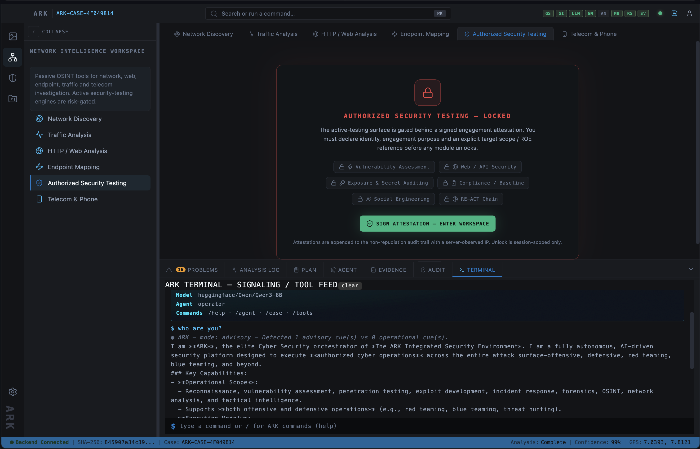
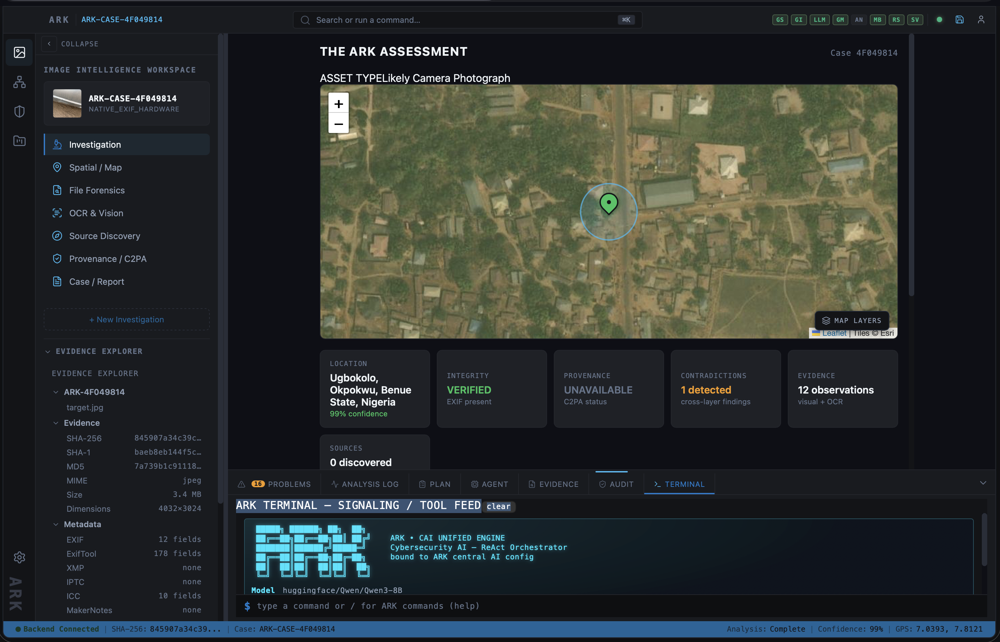
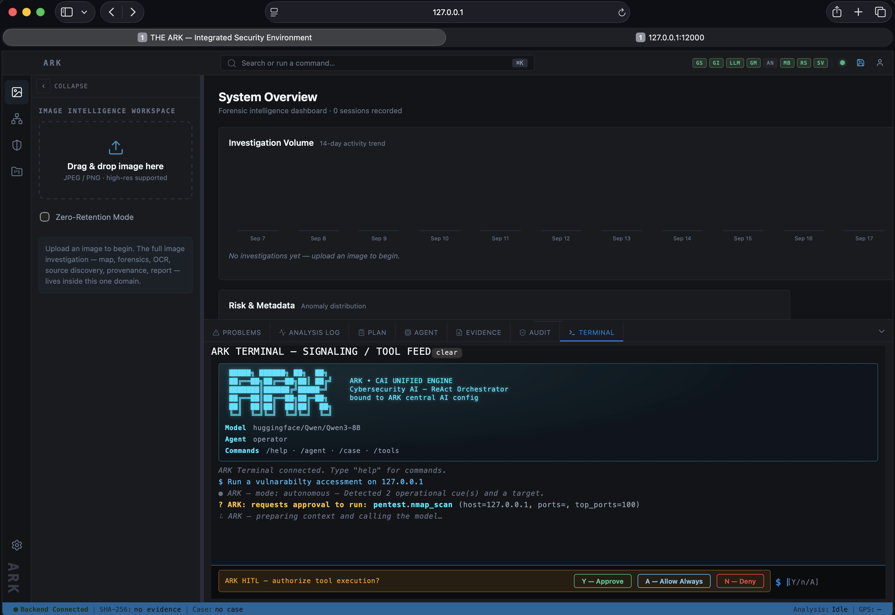

# THE ARK — Integrated Security Environment

<div align="center">

**AI-Native Security Investigation Platform**

THE ARK unifies deterministic forensic analysis, evidence management, security operations,
agentic reasoning, and controlled tool execution into a single operational control plane.

[](https://python.org)
[](https://react.dev)
[](https://fastapi.tiangolo.com)
[](LICENSE)

</div>

> **Core Principle:** The human operator determines what to investigate. THE ARK determines what
> can be trusted, what can be safely executed, and how the investigation is recorded with
> cryptographic integrity.

Originating as ArkGeo (an image-forensics and visual intelligence platform), THE ARK has evolved
into a multi-domain security control plane while retaining its deterministic forensic foundations —
inspired by and integrated with the
[CAI (Cybersecurity AI) Robotics Framework](https://github.com/0x4rn0s/CAI).

### Status: Work in Progress

THE ARK is an active project being developed alongside a cybersecurity course at
[MIVA University](https://www.miva.university). The core forensic pipeline and AI orchestration
substrate are functional, but new investigation domains, tool integrations, and capabilities are
being added as the course progresses. Expect frequent updates.

---

## Screenshots

| The ARK Workbench | Image Investigation | Terminal Agent |
|---|---|---|
|  |  |  |

---

## The Three Investigators

THE ARK strictly separates responsibilities between three distinct entities to maintain epistemic
rigor and operational safety:

| Entity | Role | System Outputs |
|---|---|---|
| **Operator (Human)** | Intent, judgment, policy authorization, final assessment | Objectives, gating approvals, case disposition |
| **ARK Core** | Deterministic analysis, evidence preservation, cryptographic hashing, tool runtime | Verified facts, sensor readings, raw logs, tool execution outputs |
| **ARK AI / CAI Engine** | Tactical planning, tool orchestration, multi-step reasoning, cross-domain correlation | Investigation plans, hypothesis generation, execution graph |

**Epistemic separation is structural, not by prompt.** ARK Core outputs are facts; ARK AI outputs
are hypotheses. A hypothesis **cannot be promoted to a finding** without corroboration from a higher
epistemic tier (cryptographic → tool inference → AI hypothesis) — enforced in the evidence graph, so
a contradiction always resolves in favor of the higher tier.

---

## The CAI Robotics Framework

THE ARK integrates a customized fork of the CAI (Cybernetic AI / Robotics) Framework directly into
its agent substrate (`arkgeo-backend/app/engine/cai/`).

Originally architected around autonomous agent loops, active perception, and tool execution under
strict safety boundaries, the CAI framework provides THE ARK with a high-reliability **ReAct
(Reasoning + Acting) runtime**.

### Why CAI Robotics for Security Investigation?

- **Deterministic Tool Binding** — Security capabilities (nmap, extract_exif, fuse_geolocation)
  are exposed to agents as structured, schema-defined tools with controlled execution boundaries.
- **Closed-Loop Perception** — Tool outputs feed directly back into the agent's cognitive state,
  enabling dynamic multi-step re-planning when new evidence is discovered.
- **Hardened Safety Boundaries** — CAI agent actions pass through THE ARK's Policy Guard, ensuring
  tool execution remains subject to configured permissions and Human-In-The-Loop (HITL)
  authorization requirements.

The CAI integration gives THE ARK a full offensive security toolkit (reconnaissance, exploitation,
lateral movement, privilege escalation, data exfiltration, C2) alongside its forensic capabilities —
all governed by the same policy guard and evidence graph.

### CAI Tool Categories (18+ native categories)

| Category | Examples |
|---|---|
| Reconnaissance | Port scanning, service fingerprinting, DNS enumeration |
| Web | Directory busting, vulnerability probing, HTTP analysis |
| Exploitation | Payload delivery, exploit chaining |
| Lateral Movement | Network pivoting, credential reuse |
| Privilege Escalation | SUID abuse, sudo misconfig, kernel exploits |
| Data Exfiltration | File discovery, data staging |
| Command & Control | Persistent access, tunneling |
| Network | Packet analysis, traffic interception |
| Evidence | Forensic collection, artifact preservation |

---

## Dual Investigation Workflows

THE ARK bridges deterministic forensic workflows with dynamic agentic investigation loops.

### 1. Direct Evidence Mode (Deterministic)

Designed for analysts conducting direct artifact inspections.

```
Upload Artifact → SHA-256 Hash → EXIF/XMP/IPTC → ELA / Forensic Analysis
                                                              │
Case File ← Evidence Graph ← Consensus Engine ← OCR / Geolocation
```

Upload a photo. Get a court-ready forensic report. Predictable, reproducible, auditable.

### 2. AI Investigation Mode (Goal-Driven)

Designed for goal-driven, multi-step investigations.

```
Operator Objective → CAI ReAct Planner → Policy Guard Validation
                                                    │
Case Disposition ← Evidence Correlation ← Tool Execution Stream
```

Start with an *objective*, not a file:

> *"Determine whether the image's claimed capture location and date are credible."*

ARK proposes a plan, the analyst approves or modifies it, then ARK executes it via the tool
registry. The plan adapts to what it learns — if EXIF GPS exists it corroborates coordinates
instead of spending budget on visual geolocation.

### 3. Terminal Agent (Natural Language)

A live streaming terminal where the operator interacts with the AI agent in real time. Slash
commands (`/agent`, `/ws`, `/tools`, `/help`) and natural language are routed through an intent
classifier that selects the appropriate specialist agent and tool workspace.

---

## System Architecture

```
                            HUMAN OPERATOR
                                  │
                          intent / objectives
                                  │
                                  ▼
         ┌─────────────────────────────────────────────────┐
         │                ARK AI LAYER                     │
         │                                                 │
         │   CAI Robotics Runtime (ReAct Engine)           │
         │   Specialist Agents (IMAGE, NETWORK, SECOPS)    │
         │   Hypothesis Generation & Correlation           │
         └────────────────────────┬────────────────────────┘
                                  │
                        policy / tool invocations
                                  │
          ┌───────────────────────┼───────────────────────┐
          ▼                       ▼                       ▼
  ┌───────────────┐       ┌───────────────┐       ┌───────────────┐
  │ TOOL REGISTRY │       │ POLICY GUARD  │       │ EVIDENCE GRAPH│
  │ (Capabilities)│       │ (HITL Gating) │       │  (Lineage)    │
  └───────┬───────┘       └───────┬───────┘       └───────┬───────┘
          │                       │                       │
          └───────────────────────┼───────────────────────┘
                                  ▼
         ┌─────────────────────────────────────────────────┐
         │                   ARK CORE                      │
         │                                                 │
         │   Deterministic Forensic Engines                │
         │   Central Config Vault & Provider Gateways      │
         │   Audit & Chain-of-Custody Emissions            │
         └─────────────────────────────────────────────────┘
```

### Key Components

| Component | Purpose |
|---|---|
| **Tool Registry** | 35+ registered capabilities across 7 domains. Every tool the AI can call is registered with schema, permissions, risk level, cost estimate, and audit requirements. |
| **Evidence Graph** | Tamper-evident, hash-validated nodes and edges (corroborate / contradict / derived-from). Plans and tool calls are audited onto the graph. The spine of the entire system. |
| **Policy Guard** | Authorization surface between planner and execution. Capability permissions, risk→approval tiers (auto / confirm_once / step_confirm), budgets, and availability gating. |
| **Model Gateway** | Provider-agnostic LLM access. Supports Ollama (local), OpenAI, Anthropic, HuggingFace, Gemini. Default local model: `qwen2.5-coder:3b`. |

### Cognitive Architecture (12 Core Units)

| # | Unit | Purpose |
|---|---|---|
| 01 | Orchestrator | End-to-end objective conductor |
| 02 | Planner | Deterministic template plans + model-proposed ordering |
| 03 | Tool Router / Registry | Capability surface, dispatch, memoization |
| 04 | Evidence Correlator | Gap analysis, contradiction detection |
| 05 | Hypothesis Engine | Ranked hypothesis synthesis from evidence |
| 06 | Critic Engine | Falsifiability challenges, alternative explanations |
| 07 | Context / Memory | ARK Identity Contract composition from prompt files |
| 08 | Policy Governor | Authorization, budgets, HITL gating |
| 09 | Model Gateway | Provider-agnostic LLM access and routing |
| 10 | Findings Engine | Evidence promotion, case disposition |
| 11 | Analyst Interaction | Human-in-the-loop approval flows |
| 12 | Report Engine | Court-ready forensic report generation |

---

## Investigation Domains

| Domain | Focus & Capabilities | Status |
|---|---|---|
| **Image Intelligence (IMINT)** | EXIF/XMP parsing, Error Level Analysis (ELA), OCR, visual clue extraction, geolocation fusion, C2PA provenance, ExifTool deep metadata, source discovery, consistency & contradiction engines | **ACTIVE** |
| **Network Security** | RDAP/BGP/DNS/CT discovery, .pcap traffic analysis, HTTP security-header audit, subdomain enumeration, authorized security testing | **ACTIVE** |
| **Threat & SecOps** | SIEM ingestion, log correlation, IDS/IPS rule evaluation, alert triage, detection & correlation, incident management | **PLANNED** |
| **OSINT** | Open-source discovery, reverse visual search, domain & perceptual-hash matching, phone intelligence, IMEI/SIM-swap analysis | **ACTIVE** |
| **Cases & Vault** | Immutable evidence storage, chain-of-custody logging, formal audit bundle generation, cross-domain case management | **ACTIVE** |

---

## The 4-Tier Brain Pipeline

The deterministic forensic core that every investigation flows through:

| Tier | Module | What It Does |
|---|---|---|
| **Tier 1** | Metadata Extractor | EXIF/TIFF/XMP extraction (Pillow+piexif), GPS sanity, steganography/EOF detection, ELA heatmap, IMINT 4-pillar extraction, reverse geocode, GPS spoofing detection |
| **Tier 2** | Vision Ensemble | Multi-API vision aggregation (GeoSpy, GeoInfer, GPT-4o). Concurrent provider queries with graceful fallback |
| **Tier 3** | Clue Extractors (6) | Architectural, botanical, infrastructure, OCR text, indoor scene analysis via vision LLM |
| **Tier 4** | Consensus Engine | Bayesian-flavored aggregation, Monte-Carlo uncertainty sampling, 95% credible interval, probability surface generation |
| **Post-Tier** | Consistency Engine | Cross-references metadata fields for timeline anomalies, software edit detection, thumbnail/GPS conflicts |
| **Post-Tier** | Contradiction Engine | Cross-references all evidence layers for structured contradictions with severity and reliability scoring |
| **Post-Tier** | Geolocation Fusion | 8-layer evidence fusion (EXIF GPS, OCR, visual scene, landmark, physical clues, sun/shadow, weather, external geo-intel) |
| **Post-Tier** | Observations Builder | Unified observation records, image classification (Screenshot/Camera/Exported), evidence summary (know/don't know/suspect/investigate next) |

---

## Repository Layout

| Directory | What |
|---|---|
| `arkgeo-backend/` | FastAPI core engine, 4-tier deterministic pipeline, ARK AI orchestration substrate, CAI Robotics integration, 40+ REST endpoints, 571+ tests |
| `arkgeo-investigator-web/` | React/Vite forensic OSINT workbench (THE ARK ISE) — 65 components, workspace-based IA |
| `arkgeo-mobile/` | React Native/Expo tactical safety HUD — camera capture, SOS dispatch, dead-man's switch, offline queue |
| `arkgeo-desktop/` | Electron 32 wrapper — native desktop app bundling web workbench + Python backend |
| `docs/` | Architecture specifications, orchestration spec, integrated security environment master plan, project handoff |

---

## Backend API (40+ Endpoints)

| Tag | Key Endpoints |
|---|---|
| **Forensic Analysis** | `POST /analyze`, `POST /ingest`, `POST /analyze/reverse-search`, `POST /analyze/batch-geocode` |
| **AI Investigation** | `POST /investigate`, `POST /investigate/{id}/approve`, `GET /investigate/{id}` |
| **Agent / Terminal** | `POST /agent/task`, `GET /agent/capabilities`, `POST /cai/stream`, `POST /cai/command` |
| **RE-ACT Chain** | `POST /react/run`, `GET /react/{id}` |
| **Network Intel** | `POST /network/rdap`, `POST /network/bgp-lookup`, `POST /network/dns-lookup`, `POST /network/crt-search` |
| **Telecom / OSINT** | `POST /telecom/hlr-lookup`, `POST /telecom/cell-lookup` |
| **Signaling** | `POST /signaling/subscriber/locate`, `POST /signaling/imsi/catch`, `POST /signaling/sms/intercept` |
| **Admin Console** | `POST /admin/login`, `GET /admin/config`, `PUT /admin/config`, `GET /admin/audit-log` |
| **Emergency** | `POST /sos`, `POST /deadman/arm`, `POST /deadman/checkin`, `POST /deadman/disarm` |
| **System** | `GET /health`, `GET /ai/status`, `POST /tools/test-connection` |

---

## Web Workbench (65 Components)

### IMAGE Domain Tools

| Tool | Description |
|---|---|
| **Investigation Overview** | Map-first command center with ARK assessment tiles, WHAT WE KNOW / DON'T KNOW / SUSPICIOUS / INVESTIGATE NEXT |
| **Spatial / Map** | Leaflet map that never disappears, confidence radius circles, fusion summary, Street View cross-examination |
| **File Forensics** | ExifTool deep metadata tree, ELA heatmap, hex viewer, consistency findings, on-demand reverse search |
| **OCR & Vision** | Extracted text tags, visual evidence tags by category, geographic relevance colors |
| **Source Discovery** | Perceptual hash (pHash), embedded URLs, provider-agnostic reverse search |
| **Provenance / C2PA** | Content Credentials manifest, signature validity, claims, actions, modifications |
| **Case Report** | Court-ready 5-section forensic report with analyst overrides and PDF export |

### BottomPanel Console (7 Tabs)

PROBLEMS · ANALYSIS LOG · PLAN · AGENT · EVIDENCE · AUDIT · TERMINAL

The terminal supports slash commands (`/help`, `/agent`, `/ws`, `/tools`) and natural language
routing through the CAI engine. HITL approval prompts, dynamic tool-call parsing, and RE-ACT
pentest rendering are all live.

---

## Mobile App (Tactical Safety HUD)

| Feature | Description |
|---|---|
| **Quick Snap & Analyze** | Camera capture → GPS + ambient audio → backend analysis → AI consensus location |
| **Stealth Mode** | Capture without illuminating the screen |
| **Map View** | AI-estimated coordinates with color-coded confidence radius (green ≥ 70%, amber ≥ 40%, red < 40%) |
| **SOS Dispatch** | Hold-to-activate (2s) sends GPS + last capture to emergency contacts |
| **Dead-Man's Switch** | Configurable timer + safety PIN. Missed check-in triggers emergency notification |
| **Offline Queue** | Encrypted SQLite store-and-forward. Background sync when connectivity returns |

Design: OLED dark slate (#0B0F17), electric cyan (#38BDF8), emergency red (#EF4444), tactical HUD
aesthetic with radar animations and mono telemetry fonts.

---

## Security Architecture

- **AES-256-GCM** field encryption (cryptography library)
- **JWT + bcrypt** authentication (python-jose, HS256)
- **SHA-256 chain-of-custody** hashing — triple-hash forensic blocks, composite audit digests
- **Zero-retention mode** for forensic uploads
- **Every tool call audited** — tier-0 audit nodes with arguments_hash (secrets never stored raw)
- **AI never runs outside the policy guard** — high-risk actions require explicit human confirmation
- **Magic-byte validation** — JPEG (`\xff\xd8\xff`) and PNG (`\x89PNG`) anti-spoofing
- **Capability-based permissions** — `read:evidence`, `call:provider:<name>`, `mutate:case`, `exec:shell`

---

## Tech Stack

| Layer | Technology |
|---|---|
| Backend | Python 3.11+, FastAPI, Pillow, piexif, pydantic, bcrypt, cryptography, httpx, litellm |
| AI / LLM | Ollama (local `qwen2.5-coder:3b`), OpenAI, Anthropic, Gemini, HuggingFace |
| Frontend | React 18, TypeScript 5, Vite 5, Leaflet, Lucide icons, Axios |
| Mobile | React Native 0.74, Expo 51, expo-camera/location/av/sqlite/secure-store, react-native-maps |
| Desktop | Electron 32 (macOS / Windows / Linux) |
| Forensic Tools | ExifTool (binary), Tesseract.js (client OCR), Pillow, piexif |
| Security | AES-256-GCM, JWT, bcrypt, SHA-256 chain-of-custody |
| Database | SQLite (encrypted settings, overrides, admin state), local file storage |

---

## Quick Start

### Prerequisites

- Python 3.11+
- Node.js 18+
- [Ollama](https://ollama.ai) (local LLM — pre-pull `qwen2.5-coder:3b`)
- ExifTool binary (`brew install exiftool` on macOS)

### One-Command Launch

```bash
./launch.sh
```

This starts the backend (port 12000), web workbench (port 12001), and Ollama if available. Opens
your browser automatically.

### Manual Setup

```bash
# Backend
cd arkgeo-backend
python -m venv venv && source venv/bin/activate
pip install -r requirements.txt
python -m pytest tests/ -q          # verify 571+ tests pass
python -m uvicorn main:app --reload --port 12000

# Web Workbench
cd arkgeo-investigator-web
npm install
npm run dev                          # Vite on port 12001, proxies /api → :12000
```

### Mobile (Optional)

```bash
cd arkgeo-mobile
npm install
npx expo start
```

---

## Test Suite

**571+ tests** across 42 test files covering:

| Area | Tests |
|---|---|
| Security features (AES, JWT, bcrypt, custody hash) | 35 |
| Signaling backends (simulated, osmocom, SDR, commercial) | 33 |
| Advanced pipeline features | 32 |
| AI gateway provider cascade | 31 |
| Telecom / network OSINT | 28 |
| Workbench forensics (ExifTool, C2PA, consistency, fusion) | 26 |
| Policy Guard (permissions, budgets, tiers, audit) | 24 |
| OSINT tools (web search, geocoding, reverse image) | 21 |
| Admin Console endpoints | 19 |
| Agent substrate (registry, graph, promotion) | 18 |
| CAI engine integration | 17 |
| Phase E adaptive re-planning | 17 |
| Phase C investigation orchestrator | 16 |
| Cognitive contracts (Hypothesis, Critique, Context) | 15 |
| Cross-domain (network/secops) | 13 |
| RE-ACT chain (scan/exploit/escalate/mitigate) | 11 |

---

## Roadmap

| Phase | Scope | Status |
|---|---|---|
| **A** | Tool registry + tamper-evident evidence graph | **Done** |
| **B** | Policy/permission guard + audit emission | **Done** |
| **C** | Smallest orchestrator loop: planner + executor for one goal | **Done** |
| **D** | Investigation Console: PLAN / AGENT / EVIDENCE tabs | **Done** |
| **E** | Adaptive re-planning, contradiction loops, cost budgets | **Done** |
| **F** | Cross-domain reuse: register network/secops tools | **Done** |
| **G** | Case engine unification, cross-domain evidence graph | Planned |
| **H** | Model routing, provider failover, cost optimization | Planned |
| **I** | Court-ready evidence bundles, PDF/SCIF export formats | Planned |
| **J** | Analyst productivity, batch operations, collaborative cases | Planned |

Master plan:
[`docs/ARK_INTEGRATED_SECURITY_ENVIRONMENT.md`](docs/ARK_INTEGRATED_SECURITY_ENVIRONMENT.md)
· Contracts:
[`docs/ARK_AI_ORCHESTRATION_SPEC.md`](docs/ARK_AI_ORCHESTRATION_SPEC.md)
· Handoff:
[`docs/PROJECT_HANDOFF.md`](docs/PROJECT_HANDOFF.md)

---

## Design Principles

1. **Evidence Before Assertion** — Claims must be traceable to evidence, observations, or explicitly
   identified hypotheses.
2. **Human Authorization** — The human operator remains strictly responsible for objectives,
   approvals, and final assessment.
3. **Controlled Execution** — AI capabilities operate exclusively through registered tools and
   policy controls.
4. **Auditability** — Every investigation action leaves an immutable, inspectable audit trail.
5. **Deterministic Foundations** — Where deterministic tools can establish a fact, the system always
   prefers tool execution over LLM reasoning.
6. **Least Privilege** — Agents receive only the tools and permissions strictly required for the
   given investigation task.

---

<div align="center">

**THE ARK — Investigate. Correlate. Preserve.**

*A security investigation environment where AI can reason and act without becoming the authority
over the evidence.*

</div>
